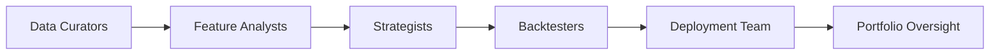

# jarjarquant

[](https://badge.fury.io/py/jarjarquant)
[](https://opensource.org/licenses/MIT)

**jarjarquant** is a Python library for quantitative finance, providing a toolkit for financial machine learning. It is inspired by the concepts in *Advances in Financial Machine Learning* by Marcos López de Prado.

## Key Features

- **Data Gathering**: Fetch historical price data from Yahoo Finance and Interactive Brokers.
- **Feature Engineering**: Create custom features and transform data.
- **Labeling**: Generate labels for machine learning models using the triple-barrier method.
- **Feature Evaluation**: Evaluate feature importance with cross-validation-based methods.
- **Data Analysis**: Perform statistical tests and analyses on financial time series.

## Core Components

**Figure 1: Strategy Production Chain**


The library is structured around the following core components:

- `DataGatherer`: For fetching financial data.
- `FeatureEngineer`: For creating and transforming features.
- `Labeller`: For labeling data for machine learning models.
- `FeatureEvaluator`: For evaluating the effectiveness of features.
- `DataAnalyst`: For statistical analysis of financial data.

### DataGatherer

The `DataGatherer` fetches historical price data.

**Example:**

```python
from jarjarquant import DataGatherer

# Fetch data for a specific ticker from Yahoo Finance
data_gatherer = DataGatherer()
spy_data = data_gatherer.get_yf_ticker("SPY", period="1y")
print(spy_data.head())
```

### FeatureEngineer

The `FeatureEngineer` is used to create and transform features from raw financial data.

**Example:**

```python
from jarjarquant import FeatureEngineer
import pandas as pd

# Create a sample DataFrame
data = {'Close': [100, 102, 101, 103, 105]}
df = pd.DataFrame(data)

# Apply fractional differentiation
feature_engineer = FeatureEngineer(df)
frac_diff_df = feature_engineer.frac_diff(d=0.5)
print(frac_diff_df)
```

### Labeller

The `Labeller` generates labels for machine learning models, such as using the triple-barrier method.

**Example:**

```python
from jarjarquant import Labeller
import pandas as pd

# Create a sample DataFrame
data = {'Close': [100, 102, 101, 103, 105, 104, 106, 107, 108, 110]}
dates = pd.to_datetime(pd.date_range(start='2023-01-01', periods=10))
df = pd.DataFrame(data, index=dates)

# Apply the triple-barrier method
labeller = Labeller(df)
labels = labeller.triple_barrier_method(df['Close'], t_events=df.index, pt_sl=[1, 1], n_days=2)
print(labels)
```

### FeatureEvaluator

The `FeatureEvaluator` assesses the importance of features using various techniques.

**Example:**

```python
from jarjarquant import FeatureEvaluator
from sklearn.ensemble import RandomForestClassifier
import pandas as pd
import numpy as np

# Sample data
X = pd.DataFrame(np.random.rand(100, 5), columns=[f'feature_{i}' for i in range(5)])
y = pd.Series(np.random.randint(0, 2, 100))
sample_weight = pd.Series(np.random.rand(100))
t1 = pd.Series(pd.date_range(start='2023-01-01', periods=100))

# Evaluate feature importance
evaluator = FeatureEvaluator()
importance, _ = evaluator.feature_importance_MDA(X, y, sample_weight, t1)
print(importance)
```

### DataAnalyst

The `DataAnalyst` provides tools for statistical analysis of financial data.

**Example:**

```python
from jarjarquant import DataAnalyst
import numpy as np

# Perform Augmented Dickey-Fuller test
data = np.random.randn(100)
analyst = DataAnalyst()
result = analyst.adf_test(data)
print(result)
```

## Installation

To install jarjarquant, use pip:

```bash
pip install jarjarquant
```

## Getting Started

Here is a complete example of how to use jarjarquant for a basic financial machine learning workflow:

```python
from jarjarquant import Jarjarquant

# 1. Initialize with data from Yahoo Finance
jq = Jarjarquant.from_yf_ticker("SPY", period="5y")

# 2. Add an indicator (e.g., RSI)
jq.add_indicator(Jarjarquant.rsi, "rsi", period=14)

# 3. Add labels using the triple-barrier method
jq.add_labels(method="triple_barrier", n_days=5, pt_sl=1)

# 4. Add sample weights
jq.add_sample_weights()

# Display the resulting DataFrame
print(jq.df.head())
```

## Available Indicators

You can list all available indicators and their parameters:

```python
from jarjarquant import Jarjarquant

jq = Jarjarquant.from_random_normal()
print(jq.list_indicators())
```

This will output a JSON string with the available indicators and their configurable parameters.

## Dependencies

jarjarquant relies on several open-source libraries, including:

-   [pandas](https://pandas.pydata.org/)
-   [numpy](https://numpy.org/)
-   [scikit-learn](https://scikit-learn.org/)
-   [statsmodels](https://www.statsmodels.org/)
-   [yfinance](https://pypi.org/project/yfinance/)
-   [ib_async](https://pypi.org/project/ib-async/)

## License

This project is licensed under the MIT License - see the [LICENSE](LICENSE) file for details.